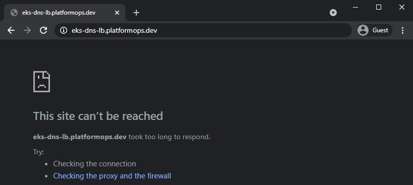
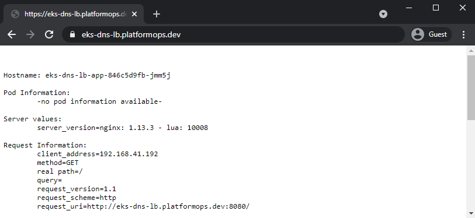
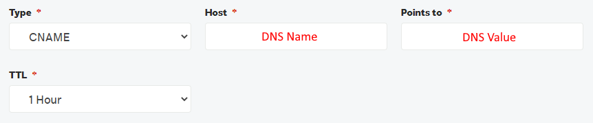
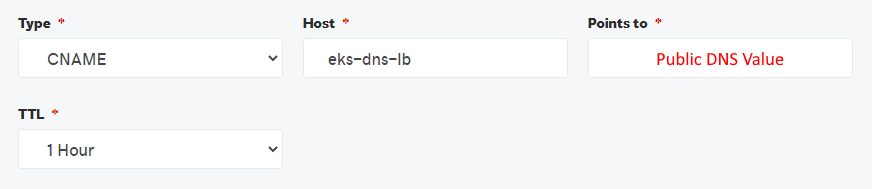

# [./ aws-cloud](/aws-cloud)

## EKS DNS Load Balancer

### Custom Domain (DNS) Forwarding to Kubernetes (EKS) Cluster via Load Balancer in AWS

In this tutorial we'll deploy Kubernetes EKS cluster in AWS, set up Network Interfaces, provision AWS SSL Certificate and Elastic Load Balancer to securely route traffic from the External (Internet) to Internal application (EKS Cluster).

### Resources Deployed

The following resources will be provisioned in EKS at the end of this tutorial.

|Name|Details|
|-----|-----|
|Elastic Kubernetes Service (EKS)|[AWS Docs](https://aws.amazon.com/eks)|
|Elastic Load Balancer|[AWS Docs](https://aws.amazon.com/elasticloadbalancing)|
|Network Interfaces|[AWS Docs](https://docs.aws.amazon.com/AWSEC2/latest/UserGuide/using-eni.html)|
|AWS SSL Certificate|[AWS Docs](https://aws.amazon.com/certificate-manager)|
|Public Elastic IP Address|[AWS Docs](https://docs.aws.amazon.com/AWSEC2/latest/UserGuide/elastic-ip-addresses-eip.html)|

### Prerequisites

You'll need these prerequisite items in order to run this tutorial.

|Name|Description|
|-----|-----|
|[AWS Account](https://aws.amazon.com/)|Your own AWS account|
|[Microsoft Powershell](https://docs.microsoft.com/en-us/powershell/scripting/overview)|We'll run all the commands in this tutorial using Powershell|
|[AWS CLI](https://aws.amazon.com/cli/)|To interact with AWS resources from Powershell|
|[EKSCTL CLI](https://docs.aws.amazon.com/eks/latest/userguide/getting-started-eksctl.html)|To interact with AWS EKS clusters from Powershell|
|[Kubernetes CLI](https://chocolatey.org/packages/kubernetes-cli)|To interact with Kubernetes cluster from Powershell|
|[Domain Name](https://en.wikipedia.org/wiki/Domain_name)|Your own Domain Name - in this tutorial I'm using my own *platformops.dev*|

### Tutorial Contents

|Name|Description|
|-----|-----|
|[eks-dns-lb.ps1](eks-dns-lb.ps1)|Powershell to run this tutorial|
|[yaml/deploy.yaml](yaml/deploy.yaml)|Deployment [YAML Template](https://kubernetes.io/docs/concepts/workloads/controllers/deployment/) for Kubernetes Application|

### Assumptions

It is assumed that beyond this point of this tutorial:
- You have *AWS Account* provisioned
- You have relevant *Roles and Privileges* setup for your User or Service Account
- You are *Logged-in* to your Account via *AWS CLI*

## Verify Pre-deployment DNS Access

Just to make sure your chosen DNS entry, in our case *eks-dns-lb.platformops.dev*, forward rule is not working.

Let's request *eks-dns-lb.platformops.dev* and the result should be the typical *This site can't be reached* error.



### Expected Result

At the end of this tutorial, your chosen DNS entry, in our case *eks-dns-lb.platformops.dev*, will return this.



## Setup Variables

Create variables to run in our tutorial - we'll reference these at various stages during this tutorial.

### AWS Account Name

This is required – it is your [AWS Account Name](https://aws.amazon.com/account/).

```powershell
$accountName = "<AWS ACCOUNT NAME>"
```

### Remaining Variables

These can be left unchanged with defaults as below or rename these to suit your naming conventions, network requirements or cluster specifics.

```powershell
$eksName = "qu-eks-1"
$region = "eu-west-2"
$kubernetesVersion = "1.19"
$nodeType = "t3.small"
$nodeCount = "1"
$volumeSize = "32"
$maxPods = "110"
$sslDomainName = "eks-dns-lb.platformops.dev"
```

## Provision AWS SSL Certificate

We'll start with provisioning SSL Certificate in AWS

### Deploy AWS SSL Certificate

```powershell
aws acm request-certificate `
--domain-name $sslDomainName `
--validation-method DNS `
--idempotency-token 91adc45q `
--options CertificateTransparencyLoggingPreference=ENABLED
```

### Acquire SSL Cert Name & Value

```powershell
$acmArn = (aws acm list-certificates `
--query 'CertificateSummaryList[*].CertificateArn' --output text)

Write-Host "DNS Name =>" `
(aws acm describe-certificate --certificate-arn $acmArn `
--query 'Certificate.DomainValidationOptions[0].ResourceRecord.Name' `
--output text)

Write-Host "DNS Value =>" `
(aws acm describe-certificate --certificate-arn $acmArn `
--query 'Certificate.DomainValidationOptions[0].ResourceRecord.Value' `
--output text)
```

### Create "CNAME" Record with Custom DNS to Verify Domain Ownership for SSL Cert Verification

If you have your NS ([Nameserver](https://en.wikipedia.org/wiki/Name_server)) Records configured with your own DNS registrar with whom you've registered your domain then you'll need to do the following.

- Login to your Domain Registrar portal
- Go to DNS settings for your Domain
- Add *CNAME* record, in our case mapping *DNS Name*, pointing to the *DNS Value* obtained above



> Note: DNS changes can take 10-20 minutes to propagate.

## Provision EKS Cluster

Next, we'll provision EKS Resource in AWS.

### Deploy EKS

Let's pass our variables to the EKSCTL CLI in order to run the deployment as one batch operation on AWS.

```powershell
eksctl create cluster `
--name $eksName `
--region $region `
--version $kubernetesVersion `
--node-type $nodeType `
--nodes $nodeCount `
--node-volume-size $volumeSize `
--max-pods-per-node $maxPods
```

> Wait for the above to finish before moving to the next step - this might take 10-20 minutes to provision in AWS.

## Deploy Applications in EKS

Great, so we have EKS cluster in AWS as well as the SSL Cert up and running now. Let's now move down to the app deployments into [Kubernetes](https://kubernetes.io/).

### Show Context Details

Confirm we are connected to correct EKS cluster context.

```powershell
kubectl config get-contexts
kubectl config current-context
```

### Get AWS SSL Cert ARN Value and replace in deploy.yaml

For this you'll need to acquire Cert ARN.

```powershell
Write-Host "AWS SSL CERT ARN =>" $acmArn
```

Manually replace in [yaml/deploy.yaml](yaml/deploy.yaml) as per example below.

```yaml
service.beta.kubernetes.io/aws-load-balancer-ssl-cert: <AWS SSL CERT ARN>
```

### Deploy Sample EKS Application

We'll use this YAML Template [yaml/deploy.yaml](yaml/deploy.yaml) to setup Namespaces, Deployment and Service.

Let's run the App deployment into our EKS cluster.

```powershell
kubectl apply -f yaml/deploy.yaml
```

### Check Deployments

Keep checking output from this command - at some stage you'll see 3x Pods Running and 1x Service.

```powershell
kubectl get all -n eks-dns-lb
```

## Configure DNS

Once we know our elastic public DNS Value we can configure it to forward calls to your domain and then all the way to our EKS in AWS.

### Acquire Public DNS Value

Let's grab our public DNS value with this command.

```powershell
Write-Host "Public DNS Value =>" `
(aws elb describe-load-balancers --query 'LoadBalancerDescriptions[*].DNSName' `
--output text)
```

### Create "CNAME" Record with Custom DNS for App Routing

If you have your NS ([Nameserver](https://en.wikipedia.org/wiki/Name_server)) Records configured with your own DNS registrar with whom you've registered your domain then you'll need to do the following.

- Login to your Domain Registrar portal
- Go to DNS settings for your Domain
- Add *CNAME* record, in our case *eks-dns-lb*, pointing to the Public DNS Value obtained above



> Note: DNS changes can take 10-20 minutes to propagate.

## Test our Application

Simply request your chosen Domain, in our case that is *eks-dns-lb.platformops.dev*, and verify that it now resolves to our sample EKS application running in Kubernetes in AWS.

> If we didn't have SSL Certificate configured as per steps above our sample EKS website would not respond because the latest browsers enforce [HTTP Strict Transport Security (HSTS)](https://en.wikipedia.org/wiki/HTTP_Strict_Transport_Security).

> Notice *SSL Certificate Padlock* now securing our app according to the HSTS standards.


## Clean-up

Simply run these commands below and within 5-10 minutes your Kubernetes and AWS Resources will be all gone.

### Delete EKS Deployments

This will delete all the resources deployed into EKS as well as the underlying AWS infrastructure such as Load Balancers, Networking Interfaces and Elastic Ip Addresses.

```powershell
kubectl delete namespace eks-dns-lb
```

### Delete AWS Resources

This deletes EKS cluster and AWS SSL Certificate.

```powershell
eksctl delete cluster --name $eksName
aws acm delete-certificate --certificate-arn $acmArn
```

### Delete CNAME Records in DNS

And of course, don't forget to delete the two *CNAME Records* we've created earlier in the DNS Setup stage for the (1) SSL Certificate Validation and (2) App Routing. Simply go to your DNS management portal and delete the two *CNAME Records*.