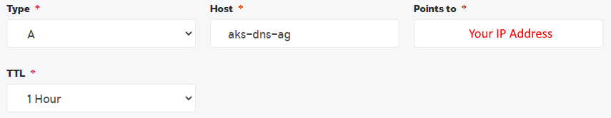
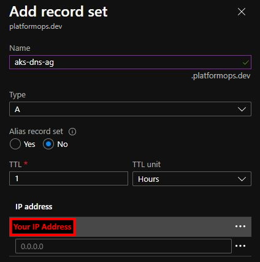

# [./ azure-cloud](/azure-cloud)

## AKS DNS Application Gateway

### Custom Domain (DNS) Forwarding to Kubernetes (AKS) Cluster via Application Gateway in Azure

In this tutorial we'll deploy Kubernetes AKS cluster in Azure, set up internal Azure networking, and Application Gateway to route traffic from the External (Internet) to Internal application (AKS Cluster).

### Resources Deployed

The following resources will be provisioned in Azure at the end of this tutorial.

|Name|Details|
|-----|-----|
|Azure Kubernetes Service (AKS)|[Azure Docs](https://docs.microsoft.com/en-us/azure/aks/intro-kubernetes)|
|Azure Application Gateway|[Azure Docs](https://docs.microsoft.com/en-us/azure/application-gateway/overview)|
|Azure Vnet & 2x Subnets|[Azure Docs](https://docs.microsoft.com/en-us/azure/virtual-network/virtual-networks-overview)|
|Public IP Address|[Azure Docs](https://docs.microsoft.com/en-us/azure/virtual-network/public-ip-addresses)|

### Prerequisites

You'll need these prerequisite items in order to run this tutorial.

|Name|Description|
|-----|-----|
|[Azure Subscription](https://azure.microsoft.com/en-gb/free/)|Your own Azure subscription - Free Trial available!|
|[Microsoft Powershell](https://docs.microsoft.com/en-us/powershell/scripting/overview)|We'll run all the commands in this tutorial using Powershell|
|[Azure CLI](https://docs.microsoft.com/en-gb/cli/azure/)|To interact with Azure resources from Powershell|
|[Kubernetes CLI](https://chocolatey.org/packages/kubernetes-cli)|To interact with Kubernetes cluster from Powershell|
|[Helm CLI](https://chocolatey.org/packages/kubernetes-helm)|To interact with Kubernetes Helm deployments from Powershell|
|[OpenSSL](https://chocolatey.org/packages/openssl)|To convert our SSL Certificate to PFX|
|[Domain Name](https://en.wikipedia.org/wiki/Domain_name)|Your own Domain Name - in this tutorial I'm using my own *platformops.dev*|
|[SSL Certificate](https://en.wikipedia.org/wiki/Public_key_certificate)|Your own SSL Certificate to secure your Domain - in this tutorial I'm using SSL Cert to secure *aks-dns-ag.platformops.dev*|

### Tutorial Contents

|Name|Description|
|-----|-----|
|[aks-dns-application-gateway.ps1](aks-dns-application-gateway.ps1)|Powershell to run this tutorial|
|[arm/aks-dns-ag-create.json](arm/aks-dns-ag-create.json)|[ARM Template](https://docs.microsoft.com/en-us/azure/azure-resource-manager/templates/overview) for Azure Resources|
|[yaml/deploy.yaml](yaml/deploy.yaml)|Deployment [YAML Template](https://kubernetes.io/docs/concepts/workloads/controllers/deployment/) for Kubernetes Application|
|[yaml/ingress-internal-values.yaml](yaml/ingress-internal-values.yaml)|Default Ingress Controller configuration|

### Assumptions

It is assumed that beyond this point of this tutorial:
- You have *Azure Subscription* provisioned
- You have relevant *Roles and Privileges* setup for your User or Service Account
- You are *Logged-in* to your Subscription via *Azure CLI*

## Verify Pre-deployment DNS Access

Just to make sure your chosen DNS entry, in our case *aks-dns-ag.platformops.dev*, forward rule is not working. 

Let's request *aks-dns-ag.platformops.dev* and the result should be the typical *This site can't be reached* error.


### Expected Result

At the end of this tutorial, your chosen DNS entry, in our case *aks-dns-ag.platformops.dev*, will return this.


## Setup Variables

Create variables to run in our tutorial - we'll reference these at various stages during this tutorial.

### Azure Subscription ID

This is required – it is your [Azure Subscription](https://azure.microsoft.com/en-gb/free/) ID.

```powershell
$subscription = "<AZURE SUBSCRIPTION ID or NAME>"
```

### Remaining Variables

These can be left unchanged with defaults as below or rename these to suit your naming conventions, network requirements or cluster specifics.

```powershell
$servicePrincipalClientName = "aks-dns-ag-sp"
$location = "westeurope"
$resourceGroupName = "aks-dns-ag-rg"
$ipAddressName = "aks-dns-ag-ip-address"
$vnetName = "aks-dns-ag-vnet"
$vnetAddressPrefix = "10.20.0.0/16"
$subnetAgName = "aks-dns-ag-subnet-application-gateway"
$subnetAgAddressPrefix = "10.20.10.0/24"
$subnetAksName = "aks-dns-ag-subnet-c1"
$subnetAksAddressPrefix = "10.20.20.0/27"
$subnetAksBackendIpAddress = "10.20.20.10"
$applicationGatewayName = "aks-dns-ag-application-gateway"
$aksName = "aks-dns-ag-c1"
$agentVMSize = "Standard_B2s"
$agentCount = "1"
$kubernetesVersion = "1.19.6"
$maxPods = "90"
```

## Deploy Azure Resources

We'll first provision all we need in Azure from the infrastructure point of view.

### Set Current Subscription

Target your subscription to run this tutorial.

```powershell
az account set --subscription $subscription
```

### Create Service Principal

This will create [App Registration](https://docs.microsoft.com/en-us/azure/active-directory/develop/quickstart-register-app) record on your [Azure Active Directory](https://azure.microsoft.com/en-gb/services/active-directory/).

```powershell
$client = (az ad sp create-for-rbac `
--skip-assignment `
--name $servicePrincipalClientName `
-o json) | ConvertFrom-Json
$clientId = $client.appId
$clientSecret = $client.password
```

### Create Resource Group

A container for all our Azure resources in this tutorial.

```powershell
az group create `
--subscription $subscription `
-l $location `
-n $resourceGroupName
```

### Assign Service Principal Role

This will assign *Contributor* Role on the Resource Group for the Service Principal so that we'll be allowed to provision resources within the Resource Group scope only.

```powershell
az role assignment create `
--assignee $clientId `
--role "Contributor" `
--resource-group $resourceGroupName
```

### Deploy ARM Template

We'll use this ARM Template [arm/aks-dns-ag-create.json](arm/aks-dns-ag-create.json) to define all the resources we need for our sample AKS app.

Next, we'll pass our variables to the template in order to run the deployment as one batch operation on Azure.

```powershell
az group deployment create `
--mode Incremental `
--subscription $subscription `
--resource-group $resourceGroupName `
--template-file arm/aks-dns-ag-create.json `
--parameters `
location=$location `
ipAddressName=$ipAddressName `
vnetName=$vnetName `
vnetAddressPrefix=$vnetAddressPrefix `
subnetAgName=$subnetAgName `
subnetAgAddressPrefix=$subnetAgAddressPrefix `
subnetAksName=$subnetAksName `
subnetAksAddressPrefix=$subnetAksAddressPrefix `
subnetAksBackendIpAddress=$subnetAksBackendIpAddress `
applicationGatewayName=$applicationGatewayName `
aksName=$aksName `
agentVMSize=$agentVMSize `
agentCount=$agentCount `
kubernetesVersion=$kubernetesVersion `
maxPods=$maxPods `
servicePrincipalClientId=$clientId `
servicePrincipalClientSecret=$clientSecret
```

> Wait for the above to finish before moving to the next step - this might take 10-20 minutes to provision in Azure.

## Deploy Applications in AKS

Great, so we have AKS cluster in Azure as well as the networking infrastructure and Application Gateway up and running now. Let's now move down to the app deployments into [Kubernetes](https://kubernetes.io/).

### Get Credentials for AKS

We now need to access AKS to start deploying apps into it. The script below will get credentials and set our sample AKS cluster as our *current context*.

```powershell
az aks get-credentials `
--resource-group $resourceGroupName `
--name $aksName
```

### Show Context Details

Confirm we are connected to correct AKS cluster context.

```powershell
kubectl config get-contexts
kubectl config current-context
```

### Deploy Sample AKS Application

We'll use this YAML Template [yaml/deploy.yaml](yaml/deploy.yaml) to setup Namespaces, Deployment, Service, Pod & Ingress Rules.

Let's run the App deployment into our AKS cluster.

```powershell
kubectl apply -f yaml/deploy.yaml
```

### Deploy Ingress Controller

We'll use this YAML Template [yaml/ingress-internal-values.yaml](yaml/ingress-internal-values.yaml) to provide default Ingress Controller values.

Let's now run the Ingress [Helm Chart](https://helm.sh/) deployment into our AKS cluster.

```powershell
helm repo add ingress-nginx https://kubernetes.github.io/ingress-nginx
helm repo update
helm install nginx-ingress `
ingress-nginx/ingress-nginx `
--namespace aks-dns-ag `
--set controller.service.loadBalancerIP=$subnetAksBackendIpAddress `
-f yaml/ingress-internal-values.yaml
```

### Check Deployments

Keep checking output from this command - at some stage you'll see 2x Pods Running and Ingress Controller assigned Internal IP Address on your Vnet.

```powershell
kubectl get all -n aks-dns-ag
```

## Acquire SSL Certificate

We'll now secure access to our sample AKS application with SSL. For that, you'll need to provision PFX certificate from your SSL Certificate Issuer. For the purposes of this tutorial, we'll acquire SSL Certificate to secure the following Subdomain *aks-dns-ag* on our Domain *platformops.dev*.

This process can sometimes cause one or two headaches, so I'll guide you here through some gotchas below.

### Certificate Private Key

This key can sometimes be provided in plain *txt* file in *UTF-8 with BOM* format. Just make sure to convert this file's format to *UTF-8 without BOM* so it's **UTF-8**.

> You can use [Notepad++](https://notepad-plus-plus.org/) for the format conversion.


### Convert Certificate to PFX

Azure Application Gateway requires the Cert in *PFX* format, therefore, if your Cert Issuer has provided it in *CRT/PEM* formats then you'll need to run this *openssl* conversion to PFX.

```powershell
openssl pkcs12 -export `
-out certificate.pfx `
-inkey <CERTIFICATE PRIVATE KEY FILE (TXT)> `
-in <CERTIFICATE FILE (CRT)> `
-certfile <OPTIONAL - ADDITIONAL CERTIFICATE FILE (CRT) >
```

## Configure Application Gateway with SSL Certificate

Azure Application Gateway will present your PFX certificate to anyone accessing your website hosted in AKS.

### Configure Application Gateway Listener

- Find the Application Gateway we've deployed earlier in Azure
- Click *Listeners*
- Click *Add Listener*
- Configure the Listener (as per example below) and click **Add**


### Configure Application Gateway Rule

- Find the Application Gateway we've deployed earlier in Azure
- Click *Rules*
- Modify our current *aks-routing* rule
- Switch Listener to point to our newly created *aks-listener-443* (as per picture below) and click **Save**


## Configure DNS

The final piece of configuration is to forward calls to your domain all the way to our AKS in Azure.

### Acquire Public IP Address

Let's first grab our Public IP address with this command.

```powershell
Write-Host "Your IP Address =>" `
(az network public-ip show `
-g $resourceGroupName `
-n $ipAddressName `
-o json --query ipAddress)
```

### Option 1 - Create "A" Record with Custom DNS

If you have your NS ([Nameserver](https://en.wikipedia.org/wiki/Name_server)) Records configured with your own DNS registrar with whom you've registered your domain then you'll need to do the following.

- Login to your Domain Registrar portal
- Go to DNS settings for your Domain
- Add *A* record, in our case *aks-dns-ag*, pointing to the Public IP Address obtained earlier



### Option 2 - Create "A" Record with Azure DNS

If you use your own [Azure DNS](https://azure.microsoft.com/en-gb/services/dns/) and [Azure DNS Zones](https://docs.microsoft.com/en-us/azure/dns/dns-zones-records) and you have your Domain NS records setup in Azure then you'll need to do the following.

- Access DNS Zone record for your Domain
- Add *A* record, in our case *aks-dns-ag*, pointing to the Public IP Address obtained earlier



> DNS changes can take few minutes to propagate. So please give it 10-20 minutes before running our final tests below.

## Test our Application

Simply request your chosen Domain, in our case that is *aks-dns-ag.platformops.dev*, and verify that it now resolves to our sample AKS application running in Kubernetes AKS in Azure.

> If we didn't have SSL Certificate configured as per steps above our sample AKS website would not respond because the latest browsers enforce [HTTP Strict Transport Security (HSTS)](https://en.wikipedia.org/wiki/HTTP_Strict_Transport_Security).

> Notice *SSL Certificate Padlock* now securing our app according to the HSTS standards.


## Clean-up

Simply run these commands below and within 5-10 minutes your Kubernetes and Azure Resources will be all gone.

### Clear AKS Access Details

This deletes your AKS cluster context and access details to the cluster form your workstation.

```powershell
kubectl config delete-context $aksName
kubectl config unset users.clusterUser_"$resourceGroupName"_"$aksName"
kubectl config unset contexts.$aksName
kubectl config unset clusters.$aksName
```

### Delete Azure Resources

This deletes Service Principal and all Azure Resources (infrastructure) we've provisioned for this tutorial.

```powershell
az ad sp delete --id $clientId
az group delete `
--subscription $subscription `
--name $resourceGroupName `
--yes
```

### Delete A Record in DNS

And of course, don't forget to delete the *A Record* we've created earlier in the DNS Setup stage. Simply go to your DNS management portal and delete the *A Record*.