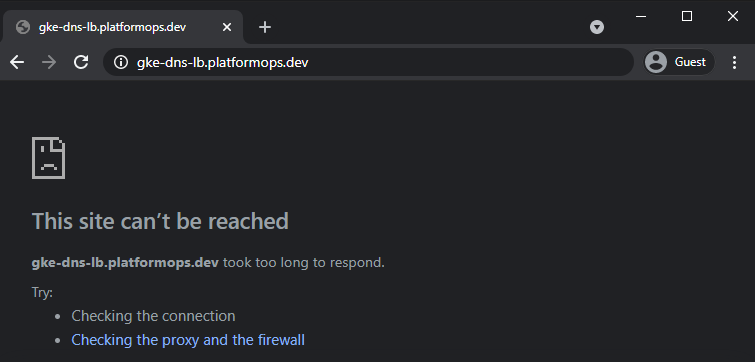
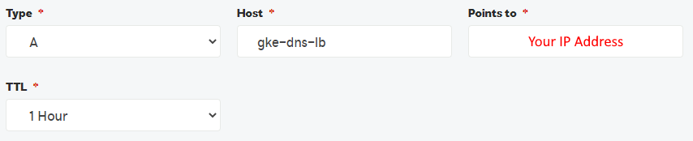

# [./ google-cloud](/google-cloud)

## GKE DNS Load Balancer

### Custom Domain (DNS) Forwarding to Kubernetes (GKE) Cluster via Load Balancer in GCP

In this tutorial we'll deploy Kubernetes GKE cluster in GCP, set up GCP VPC Network, provision GCP SSL Certificate and Load Balancer to securely route traffic from the External (Internet) to Internal application (GKE Cluster).

### Resources Deployed

The following resources will be provisioned in GCP at the end of this tutorial.

|Name|Details|
|-----|-----|
|Google Kubernetes Engine (GKE)|[GCP Docs](https://cloud.google.com/kubernetes-engine)|
|GCP Load Balancer|[GCP Docs](https://cloud.google.com/load-balancing)|
|GCP VPC Network|[GCP Docs](https://cloud.google.com/vpc)|
|GCP SSL Certificate|[GCP Docs](https://cloud.google.com/load-balancing/docs/ssl-certificates/google-managed-certs)|
|Public IP Address|[GCP Docs](https://cloud.google.com/vpc/docs/ip-addresses)|

### Prerequisites

You'll need these prerequisite items in order to run this tutorial.

|Name|Description|
|-----|-----|
|[GCP Account](https://cloud.google.com)|Your own GCP account - Free Credits available!|
|[Microsoft Powershell](https://docs.microsoft.com/en-us/powershell/scripting/overview)|We'll run all the commands in this tutorial using Powershell|
|[GCP SDK CLI](https://cloud.google.com/sdk)|To interact with GCP resources from Powershell|
|[Kubernetes CLI](https://chocolatey.org/packages/kubernetes-cli)|To interact with Kubernetes cluster from Powershell|
|[Domain Name](https://en.wikipedia.org/wiki/Domain_name)|Your own Domain Name - in this tutorial I'm using my own *platformops.dev*|

### Tutorial Contents

|Name|Description|
|-----|-----|
|[gke-dns-lb.ps1](gke-dns-lb.ps1)|Powershell to run this tutorial|
|[yaml/deploy.yaml](yaml/deploy.yaml)|Deployment [YAML Template](https://kubernetes.io/docs/concepts/workloads/controllers/deployment/) for Kubernetes Application|

### Assumptions

It is assumed that beyond this point of this tutorial:
- You have *GCP Account* provisioned
- You have relevant *Roles and Privileges* setup for your User or Service Account
- You are *Logged-in* to your Account via *GCP CLI*

## Verify Pre-deployment DNS Access

Just to make sure your chosen DNS entry, in our case *gke-dns-lb.platformops.dev*, forward rule is not working.

Let's request *gke-dns-lb.platformops.dev* and the result should be the typical *This site can't be reached* error.



### Expected Result

At the end of this tutorial, your chosen DNS entry, in our case *gke-dns-lb.platformops.dev*, will return this.


## Setup Variables

Create variables to run in our tutorial - we'll reference these at various stages during this tutorial.

### GCP Project Name

This is required – it is your [GCP Project Name](https://cloud.google.com/resource-manager/docs/creating-managing-projects).

```powershell
$projectName = "<GCP PROJECT NAME>"
```

### Remaining Variables

These can be left unchanged with defaults as below or rename these to suit your naming conventions, network requirements or cluster specifics.

```powershell
$gkeName = "qu-cluster-1"
$region = "europe-west2"
$zone = "europe-west2-a"
$kubernetesVersion = "1.19.8-gke.1600"
$kubernetesReleaseChannel = "None"
$nodesCount = "1"
$maxPods = "110"
$machineType = "custom-1-1024"
$machineImage = "COS"
$diskType = "pd-standard"
$diskSize = "32"
$ipAddressName = "gke-dns-lb-ip"
```

## Deploy GCP Resources

We'll first provision all we need in GCP from the infrastructure point of view.

### Deploy GKE

Let's pass our variables to the GCP CLI in order to run the deployment as one batch operation on GCP.

```powershell
gcloud container clusters create $gkeName `
--project $projectName `
--zone $zone `
--node-locations $zone `
--no-enable-basic-auth `
--enable-shielded-nodes `
--cluster-version $kubernetesVersion `
--release-channel $kubernetesReleaseChannel `
--machine-type $machineType `
--image-type $machineImage `
--disk-type $diskType `
--disk-size $diskSize `
--metadata disable-legacy-endpoints=true `
--num-nodes $nodesCount `
--no-enable-stackdriver-kubernetes `
--enable-ip-alias `
--network "projects/$projectName/global/networks/default" `
--subnetwork "projects/$projectName/regions/$region/subnetworks/default" `
--default-max-pods-per-node $maxPods `
--no-enable-master-authorized-networks `
--addons HttpLoadBalancing `
--no-shielded-integrity-monitoring `
--quiet
```

> Wait for the above to finish before moving to the next step - this might take 10-20 minutes to provision in GCP.

### Provision Public IP Address

We'll need this Ip Address to point our DNS to the GKE instance in GCP.

```powershell
gcloud compute addresses create $ipAddressName `
--project $projectName `
--global `
--quiet
```

## Configure DNS

Once we know our public IP Address we can configure it to forward calls to your domain and then all the way to our GKE in GCP.

### Acquire Public IP Address

Let's grab our public IP address with this command.

```powershell
Write-Host "Your IP Address =>" `
(gcloud compute addresses describe $ipAddressName `
--project $projectName `
--global `
--format="value(address)")
```

### Create "A" Record with Custom DNS

If you have your NS ([Nameserver](https://en.wikipedia.org/wiki/Name_server)) Records configured with your own DNS registrar with whom you've registered your domain then you'll need to do the following.

- Login to your Domain Registrar portal
- Go to DNS settings for your Domain
- Add *A* record, in our case *gke-dns-lb*, pointing to the Public IP Address obtained earlier



> Note: DNS changes can take 10-20 minutes to propagate.

## Deploy Applications in GKE

Great, so we have GKE cluster in GCP as well as the networking infrastructure, public IP address and DNS up and running now. Let's now move down to the app deployments into [Kubernetes](https://kubernetes.io/).

### Get Credentials for GKE

We now need to access GKE to start deploying apps into it. The script below will get credentials and set our sample GKE cluster as our *current context*.

```powershell
gcloud container clusters get-credentials $gkeName `
--project $projectName `
--zone $zone
```

### Show Context Details

Confirm we are connected to correct GKE cluster context.

```powershell
kubectl config get-contexts
kubectl config current-context
```

### Deploy Sample GKE Application

We'll use this YAML Template [yaml/deploy.yaml](yaml/deploy.yaml) to setup Namespaces, Deployment, Service, Pod, Ingress and SSL Certificate.

Let's run the App deployment into our GKE cluster.

```powershell
kubectl apply -f yaml/deploy.yaml
```

### Check Deployments

Keep checking output from this command - at some stage you'll see 1x Pod Running, 1x Ingress and SSL Certificate Provisioned.

```powershell
kubectl get all -n gke-dns-lb
kubectl get ingress -n gke-dns-lb
kubectl get managedcertificate -n gke-dns-lb
```

> Wait for the above to finish before moving to the next step - the SSL Certificate can stay in *Provisioning* state for up to 60 minutes before it becomes *Active*.

## Test our Application

Simply request your chosen Domain, in our case that is *gke-dns-lb.platformops.dev*, and verify that it now resolves to our sample GKE application running in Kubernetes in GCP.

> If we didn't have SSL Certificate configured as per steps above our sample GKE website would not respond because the latest browsers enforce [HTTP Strict Transport Security (HSTS)](https://en.wikipedia.org/wiki/HTTP_Strict_Transport_Security).

> Notice *SSL Certificate Padlock* now securing our app according to the HSTS standards.


## Clean-up

Simply run these commands below and within 5-10 minutes your Kubernetes and GCP Resources will be all gone.

### Delete GKE Deployments

This will delete all the resources deployed into GKE as well as the underlying GCP infrastructure, such as Load Balancers, Routing Rules and SSL Certificate.

```powershell
kubectl delete namespace gke-dns-lb
```

### Delete GCP Resources

This deletes GKE cluster and public IP address (infrastructure) we've provisioned for this tutorial.

```powershell
gcloud container clusters delete $gkeName `
--project $projectName `
--zone $zone `
--quiet

gcloud compute addresses delete $ipAddressName `
--project $projectName `
--global `
--quiet
```

### Clear GKE Access Details

This deletes your GKE cluster context and access details to the cluster form your workstation.

```powershell
kubectl config delete-context gke_"$projectName"_"$zone"_"$gkeName"
kubectl config unset users.gke_"$projectName"_"$zone"_"$gkeName"
kubectl config unset contexts.gke_"$projectName"_"$zone"_"$gkeName"
kubectl config unset clusters.gke_"$projectName"_"$zone"_"$gkeName"
```

### Delete A Record in DNS

And of course, don't forget to delete the *A Record* we've created earlier in the DNS Setup stage. Simply go to your DNS management portal and delete the *A Record*.
